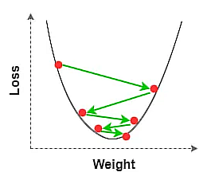
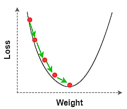
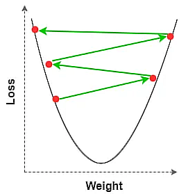
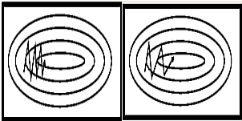

# <u><b>Optimiseur explication</u> :</b>

## <u>Introduction</u> :

Le but de ce fichier est de faire un point sur tous les algorithmes d'optimisation en deep learning, leur avantages et inconvénients et surtout comment ils marchent (idée intuitive de chaque algorithme).

## 1. <u>GD : Gradient Descent</u>

La classique descente de gradient. Le but est d'appliquer aux paramètres la formule : 

$$W_{t+1} = W_{t} - \eta\nabla L$$

Ici $W_t$ représente les paramètres à l'epoch $t$, $\eta$ représente le learning rate et $\nabla L$ le gradient de la fonction de loss.

L'idée ici est d'actualiser les paramètres en fonction de la variation de la fonction de loss, car en effet :

$$\nabla L = \dfrac{\partial L}{\partial W_t}$$

Si la variation de $L$ en fonction de $W_t$ est décroissante, alors le gradient est négatif et vice versa. Ainsi on rajoute un terme positif ou négatif à $W_t$ pour former $W_{t+1}$ pour faire varier $L$ vers un minimum local. Une fois ce minimum atteint $\nabla L = 0$ donc $W_{t+1} = W_t$ et il y a convergence.

On peut faire varier $\eta$ pour converger plus vite mais on risque de un phénomène d'oscillation (on dépasse le minimum, le gradient change de signe et on redépasse le minimum et ainsi de suite...)

L'avantage de cette méthode est qu'elle marche très bien peut importe la situation. Le désavantage est qu'appliquer cet algorithme sur tout le dataset peut prendre un temps considérable...

## 2. <u>SGD : Stochastic Gradient Descent with Momentum</u>

Pour faire face au problème de la descente de gradient classique à savoir la taille des données prise en entrée, on veut ici des batchs pour appliquer **GD** dessus. Le but ici est d'avoir donc pris des batchs, de mélanger les données et ainsi de suite pour avoir une approximation de ce qu'on aurait dû obtenir avec tout le dataset. En quelque sorte on donne alors une approximation de la **GD**, ce qui demande alors finalement une plus grande quantité d'epoch pour l'apprentissage (on rajoute du bruit en quelque sorte sur le chemin vers notre minimum). Cependant cela permet quand même de réduire le temps d'apprentissage dans le cas d'un très gros dataset avec **GD**

Maintenant on veut corriger les effets du learning rate (si trop petit, convergence lente et si trop grand convergence lente voir divergence à cause des oscillations). Pour cela on veut appliquer un momentum.
 &nbsp;&nbsp;&nbsp;&nbsp;&nbsp;&nbsp;&nbsp;&nbsp;&nbsp;&nbsp;&nbsp;&nbsp;&nbsp;

  

 

L'idée du momentum est de garder un terme provenant de l'ancienne update :

$U_{t} = -\eta\nabla L$ : Cas de **GD** 

$U_{t} = -\eta\nabla L + \alpha W_{t-1}$ : cas de **SGD** avec momentum

Ce qui donne pour **SGD** : 

$W_{t+1} = W_t - \eta\nabla L + \alpha W_{t-1}$

Avec donc $\alpha$ le decay rate (variable prenant en compte plus ou moins le terme des paramètres à l'epoch $t-1$ prenant lui même en compte les paramètres au stade $t-2$ etc...)

- On peut distinguer le cas $\alpha = 0$ : on retrouve alors la formule de la descente du gradient sans momentum

- $\alpha = 1$ : alors on a pas de decay. C'est-à-dire qu'au fur et à mesure des itérations, les termes précédents changent de plus en plus le comportement des poids futurs amenant ainsi à des comportements d'oscillations voir de divergence.

Cela permet ainsi de réduire l'impact du bruit sur la direction de la fonction de loss lors de l'actualisation des paramètres et ainsi aller vers une convergence plus rapide.

  

 

## 3. <u>RMSProp : Root Mean Square Propagation</u> 

L'idée derrière cet algorithme est de calculer une moyenne mobile des carrés des gradients par une moyenne pondérée en exponentielle. Cela permet de considérer les poids les plus récents alors que les poids les plus anciens ont une contribution diminuant rapidement : 

$$E[g^2](t) = \alpha E[g^2](t-1) + (1-\alpha) (\dfrac{\partial L}{\partial w})^2$$

Le 1er terme de l'équation diminue en fonction de $\alpha$, c'est à dire que la contribution du prochain terme est diminué de $\alpha(1-\alpha)$ (faut développer un cran plus loin pour le voir). \
Le gradient au carré a une importance notamment dans la formule de l'update :

$$w_{ij}(t+1) = w_{ij}(t) - \dfrac{\eta}{\sqrt{E[g^2](t)}}\dfrac{\partial L}{\partial w_{ij}} $$

$w_{ij}$ : poids envoyé du neurone j au neurone i (on considère alors le neurone i)

Ici il est intéressant de noter que le but est d'ajuster $\eta$ en le divisant par un terme qui dépend des précédentes mise à jour. En effet si aux rangs précédents on a fortement modifié les poids, alors $E[g^2](t)$ sera d'autant plus important.

Finalement RMSProp permet de mettre à jour les poids plus uniformément en prenant fortement en compte les mise-à-jour récente et en réduisant fortement l'impact des anciennes. Ainsi les fortes mise-à-jour réduiront grandement le learning rate pour les 1~2 prochaines mises à niveau des poids seulement. Cela permet ainsi de prendre un learning rate faisant rapidement converger et qui s'adapate pour chaque poids en étant réduit lorsqu'un poids tente de converger fortement évitant ainsi les phénomènes d'oscillations un maximum.

## 4. <u>AdaGrad : Adaptive Gradient</u> 

Le but de cet algorithme est de régler les même problème qu'avec RMSProp. En effet on veut donc adapter le learning rate pour qu'il prenne en compte les mises à jour importante récentes des poids et vice versa.

Pour ça on va prendre la somme des carré des gradients :

$$G(t) = \sum^t_{i=1}(\dfrac{\partial L}{\partial w(i)})(\dfrac{\partial L}{\partial w(i)})^T = \sum^t_{i=1}||\dfrac{\partial L}{\partial w(i)}||^2$$

On va ensuite diviser le learning rate par la racine carré de $G(t)$ :

$$w_{t+1} = w_t - \dfrac{\eta}{\sqrt{G(t)}}\dfrac{\partial L}{\partial w_t} $$

Cependant pour des raisons de simplicité en terme de complexité, on ne prend que les éléments diagonaux de $G(t)$ auquels on rajoute un terme d'erreur pour éviter des soucis de singularité (erreur si jamais l'une des valeurs est 0 par exemple...)

De plus, cet algorithme présente un désavantage. En effet, il est sensible aux paramètres d'initialisation. Si les gradients sont importants au début, on va intialiser le learning assez bas. Cependant l'accumulation des termes du gradient va faire baisser le learning rate beaucoup trop tôt et vite, ce qui peut ainsi ralentir fortement le temps de convergence.

## 5. <u>Adadelta : </u> 

En ce qui concerne cet algorithme, il s'appuie sur le même principe que AdaGrad, seulement pour régler le désavantage précédent, on veut prendre une moyenne pondérée en exponentielle comme pour RMSProp :

$G(t)$ devient alors :

$$ G(t) = \alpha G(t-1) + (1-\alpha)||\dfrac{\partial L}{\partial w}||^2 $$ 
**Rq** : En réalité on ne prend pas la valeur du gradient directement mais une estimation selon la formule : $$g_t = \frac{1}{n}\sum^n_{i=1}\nabla_\theta L(x^{(i)},y^{(i)}, \theta_t) $$

Et ce pour toutes les valeurs de gradient qui suivent...

A partir de maintenant ce qu'on veut faire, c'est comme pour RMSProp, c'est à dire d'obtenir une moyenne. Pour AdaDelta, elle est définie telle que :

$$ E[\Delta x^2](t) = \alpha E[\Delta x^2](t-1) + (1 - \alpha)\Delta x^2_t  $$

Avec $\Delta x_t = -\dfrac{\sqrt{\Delta x_{t-1}+\epsilon}}{\sqrt{G(t)}}\dfrac{\partial L}{\partial w} $

Si on résume alors la formule de l'update, on a alors :

$$ w_{t+1} = w_t + \Delta x_t $$

Ainsi en décorticant le terme $\Delta x$ on observe qu'il n'y a pas de learning rate mais un terme corrigé faisant office de learning rate adaptatif (à voir cette partie dans une étude antérieure)

## 6. <u>Adam : Adaptive Moment Estimation</u> 

Le dernier mais pas des moindres, le populaire Adam est un algorithme qui combine les algorithmes de **SGD** avec momentum et **RMSProp**. Ainsi le but est d'ajouter un momentum pour éviter le bruit lors de la convergence tout en adaptant le learning rate au fur et à mesure des itérations.

En ce qui concerne Adam, l'algorithme utilise deux moments. Le premier est une moyenne des gradients et le deuxième est une variance tout ça en prenant donc une moyenne pondérée exponentielle comme précédemment.